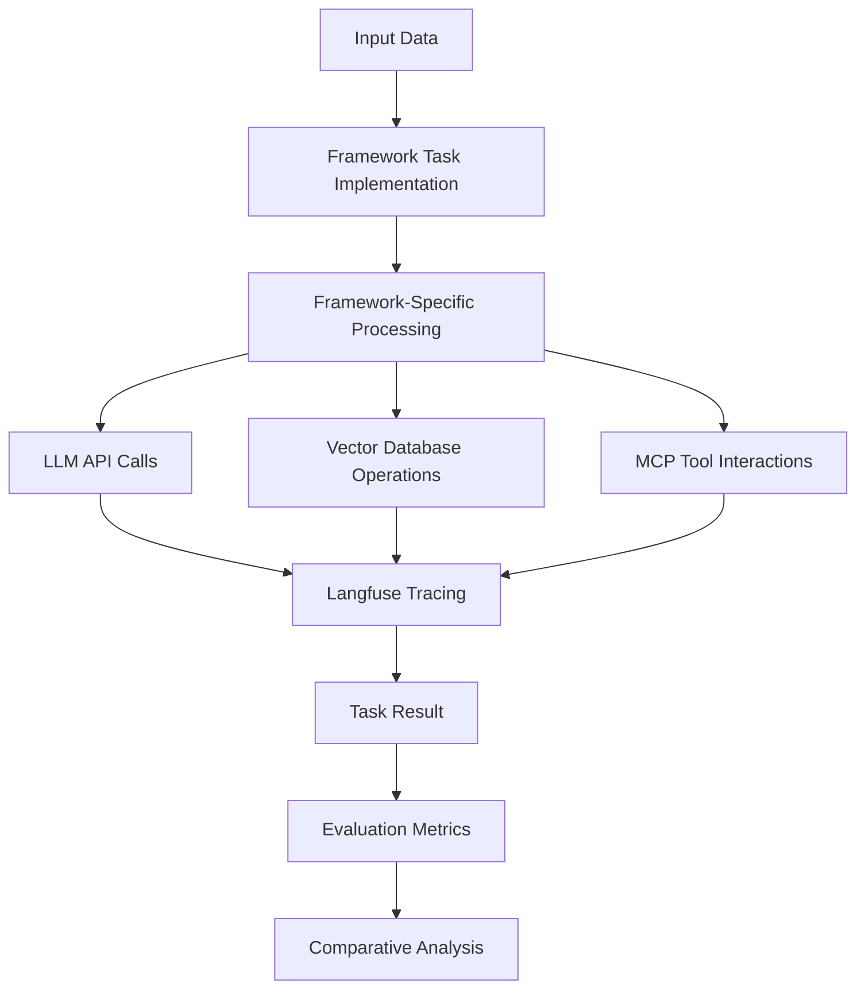
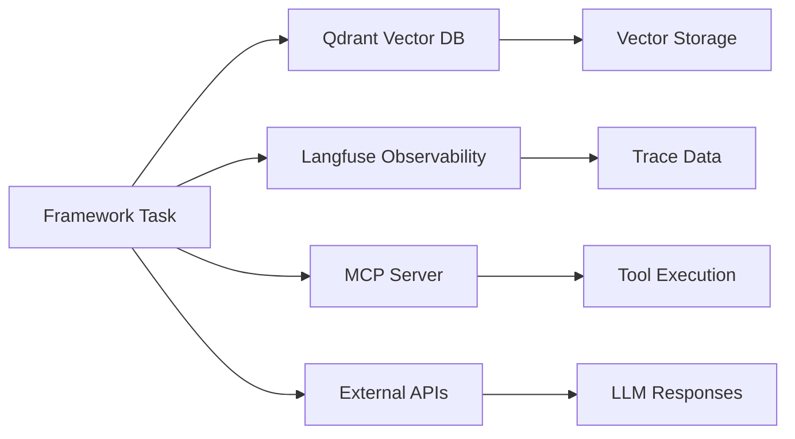

# Architecture Guide: AI Agent Frameworks Comparison

## 🏗️ System Architecture Overview

The AI Agent Frameworks Comparison Project employs a **framework-isolated architecture** designed to ensure fair, unbiased comparison while maintaining operational consistency across evaluations.

## 🎯 Design Principles

### 1. Complete Framework Isolation
- **Independent Dependencies**: Each framework maintains its own `pyproject.toml` and dependency ecosystem
- **Isolated Infrastructure**: Dedicated Qdrant, Langfuse, and MCP server instances per framework
- **Separate Environments**: Framework-specific environment variables and configurations
- **Port Isolation**: Non-conflicting port assignments prevent service interference

### 2. Standardized Evaluation Interface
- **Common Task Interface**: All frameworks implement identical task execution patterns
- **Unified Metrics Collection**: Consistent performance and quality measurement
- **Shared Test Data**: Common datasets ensure fair comparison across frameworks
- **Standardized Output Format**: Uniform result structures for analysis

### 3. Operational Consistency
- **Shared Infrastructure Templates**: Common Docker Compose patterns customized per framework
- **Consistent Monitoring**: Unified observability through Langfuse integration
- **Standard Development Workflow**: Common patterns for development and testing

## 🏢 Directory Structure Design

```
agent_benchmark/
├── 📁 Framework Directories (Isolated)
│   ├── crewai/                    # CrewAI implementation
│   ├── dspy/                      # DSPy implementation
│   ├── pocketflow/                # PocketFlow implementation
│   ├── google_adk/                # Google ADK implementation
│   └── pydantic_ai/               # Pydantic AI implementation
│
├── 📁 Shared Components (Cross-Framework)
│   ├── shared_datasets/           # Common test data
│   ├── evaluation/                # Evaluation framework
│   ├── shared_infrastructure/     # Docker templates
│   └── docs/                      # Documentation
│
└── 📁 Project Management
    ├── .ai/                       # AI assistant context
    ├── README.md                  # Project overview
    ├── ARCHITECTURE.md            # This document
    └── GETTING_STARTED.md         # Quick start guide
```

## 🔧 Framework-Specific Architecture

Each framework directory follows a consistent internal structure:

```
{framework_name}/
├── pyproject.toml                 # Framework-specific dependencies
├── uv.lock                        # Locked dependency versions
├── docker-compose.yaml            # Infrastructure stack
├── .env                           # Environment configuration
├── shared/                        # Framework-internal shared components
│   ├── config.py                  # Configuration management
│   ├── database.py                # Qdrant integration
│   ├── tracing.py                 # Langfuse observability
│   └── mcp_client.py              # MCP protocol client
└── task{n}_{name}/                # Individual task implementations
    ├── main.py                    # Task entry point
    ├── {framework_specific}.py    # Framework implementation
    └── evaluation.py              # Task-specific metrics
```

## 🔄 Data Flow Architecture

### 1. Task Execution Flow


### 2. Infrastructure Communication


## 🛡️ Isolation Mechanisms

### 1. Dependency Isolation
- **UV Virtual Environments**: Each framework uses isolated Python environments
- **Version Locking**: `uv.lock` files ensure reproducible builds
- **Conflict Prevention**: No shared dependencies between frameworks

### 2. Infrastructure Isolation
- **Container Naming**: Framework-prefixed container names prevent conflicts
- **Network Isolation**: Dedicated Docker networks per framework
- **Volume Separation**: Framework-specific data persistence
- **Port Management**: Non-overlapping port ranges

### 3. Data Isolation
- **Vector Collections**: Framework-specific Qdrant collections
- **Trace Separation**: Isolated Langfuse projects per framework
- **Environment Variables**: Framework-specific configuration

## 📊 Evaluation Architecture

### 1. Metrics Collection
```python
# Standardized evaluation interface
class BaseEvaluator(ABC):
    def evaluate_response_quality(self, expected, actual) -> Dict[str, float]
    def measure_performance(self, execution_func) -> Dict[str, float]
    def execute_with_monitoring(self, task_name, execution_func, input_data) -> TaskResult
```

### 2. Comparative Analysis
- **Unified Result Format**: `TaskResult` model ensures consistent data structure
- **Aggregate Metrics**: Cross-framework performance comparison
- **Statistical Analysis**: Significance testing and confidence intervals

### 3. Reporting System
- **Automated Reports**: Generated comparison dashboards and summaries
- **Multiple Formats**: HTML, PDF, CSV, and JSON outputs
- **Interactive Visualizations**: Framework performance comparisons

## 🔌 Integration Points

### 1. Shared Datasets
- **Common Test Data**: Identical inputs across all frameworks
- **Ground Truth**: Expected outputs for quality evaluation
- **Metadata**: Dataset descriptions and evaluation criteria

### 2. Evaluation Framework
- **Base Classes**: Abstract interfaces for consistent implementation
- **Metric Calculators**: Standardized quality and performance measurement
- **Report Generators**: Automated analysis and visualization

### 3. Infrastructure Templates
- **Docker Compose Templates**: Customizable infrastructure patterns
- **Environment Templates**: Standard configuration patterns
- **Deployment Scripts**: Consistent setup and teardown procedures

## 🚀 Scalability Considerations

### 1. Horizontal Scaling
- **Framework Parallelization**: Independent framework execution
- **Task Distribution**: Parallel task execution within frameworks
- **Resource Allocation**: Configurable resource limits per framework

### 2. Performance Optimization
- **Caching Strategies**: Shared embeddings and computed results
- **Resource Monitoring**: Real-time performance tracking
- **Load Balancing**: Distributed execution across infrastructure

### 3. Extensibility
- **Plugin Architecture**: Easy addition of new frameworks
- **Task Templates**: Standardized patterns for new task types
- **Metric Extensions**: Pluggable evaluation metrics

## 🔒 Security Architecture

### 1. API Key Management
- **Environment Isolation**: Framework-specific API key storage
- **Secret Management**: Secure handling of sensitive credentials
- **Access Control**: Limited scope API permissions

### 2. Network Security
- **Container Isolation**: Restricted network communication
- **Port Management**: Minimal exposed ports
- **Data Encryption**: Secure data transmission and storage

### 3. Audit Trail
- **Comprehensive Logging**: All operations tracked and logged
- **Trace Correlation**: End-to-end request tracking
- **Security Monitoring**: Anomaly detection and alerting

## 🔧 Development Architecture

### 1. Development Workflow
- **Framework-Specific Development**: Independent development environments
- **Shared Tooling**: Common development utilities and scripts
- **Testing Strategy**: Unit, integration, and end-to-end testing

### 2. Quality Assurance
- **Code Standards**: Consistent coding patterns and documentation
- **Automated Testing**: Comprehensive test coverage
- **Performance Benchmarking**: Continuous performance monitoring

### 3. Deployment Strategy
- **Environment Parity**: Consistent development and production environments
- **Infrastructure as Code**: Reproducible infrastructure deployment
- **Monitoring Integration**: Production observability and alerting

This architecture ensures fair, comprehensive comparison of AI agent frameworks while maintaining operational excellence and development efficiency.
